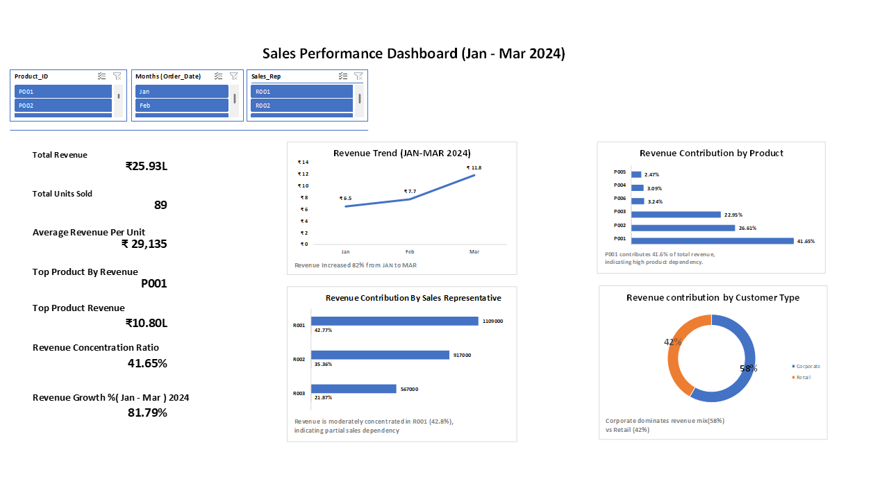

# Sales Performance Dashboard (Excel)

## Project Overview
This project presents an interactive **Sales Performance Dashboard built in Microsoft Excel** to analyze revenue trends, product performance, regional sales, and sales representative contribution.

The goal of the dashboard is to help business stakeholders quickly understand **what drives sales performance and where improvements are needed**.

---

## Business Questions Answered
The dashboard helps answer key business questions such as:

- Which **products generate the highest revenue**?
- Which **regions contribute most to overall sales**?
- Which **sales representatives perform best**?
- How do **sales trends change over time**?
- Which **customer segments drive revenue growth**?

---

## Dataset Description
The dataset contains transactional sales data including:

- Order Date
- Product Category
- Product Name
- Region
- Sales Representative
- Customer Segment
- Revenue / Sales Amount
- Quantity Sold

The data was cleaned and structured to support analysis and dashboard creation.

---

## Data Preparation
The following steps were performed in Excel:

1. Data cleaning and formatting
2. Handling missing or inconsistent values
3. Creating calculated fields
4. Preparing structured tables for PivotTables

---

## Analysis & Dashboard Features
The Excel dashboard includes:

- **Total Revenue KPI**
- **Sales by Region**
- **Sales by Product Category**
- **Sales Trend Over Time**
- **Top Performing Sales Representatives**
- **Customer Segment Contribution**

Interactive **slicers and filters** allow users to explore the data dynamically.

---

## Tools Used
- Microsoft Excel
- Pivot Tables
- Pivot Charts
- Excel Formulas
- Data Cleaning Techniques

---

## Dashboard Preview

---
## Key Insights

Analysis of the dataset reveals several important insights:

- Certain **product categories consistently outperform others** and contribute the largest share of overall revenue.
- A limited number of **sales representatives generate a significant portion of total sales**, indicating performance concentration within the team.
- **Monthly sales trends show fluctuations**, suggesting the presence of seasonal or demand-driven sales patterns.
- Some **products contribute high revenue despite lower sales volume**, indicating higher pricing or value products.
- A small group of **top-performing products drive a large share of total sales**, reflecting a typical Pareto distribution in business sales.
- Customer purchase behavior indicates that **specific segments contribute more consistently to revenue**, making them key target groups for business growth.

These insights help businesses focus their strategy on high-performing products, top sales representatives, and important customer segments.

---

## Project Structure

sales-performance-dashboard-excel/
│
├── sales-performance-dashboard-excel.xlsx
├── sales-dashboard-preview.png
└── README.md
